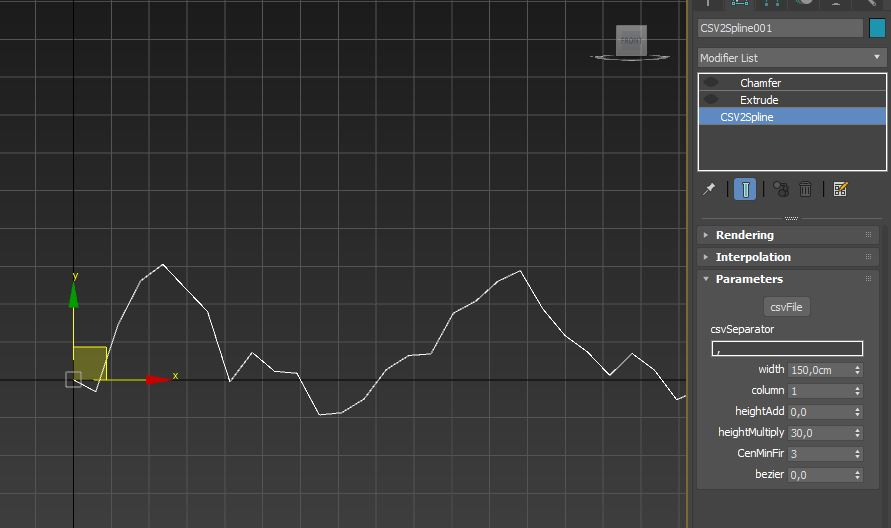

# MCG 3dsmax 

[TOC]

## CSV2Spline

    source\CSV2Spline.maxtool

Create spline from selectable CSV column. 

Multiply your height by a user-defined value. Select Pivot from Center, Minium or from first value.  Set the width according to the system unit scale.

- `csvFile` select your CSV file 
- `csvSeperator`  your CSV sperator string  
- `width` of every step in sytem units 
- `heightAdd` change height position in chart units 
- `heightMultiplier` multpliy height width 
- `CenMinFir` change pivot to height center, min or first data point 
- `bezier` add bezier rounding 

## Coding Reference 

- Arrays https://area.autodesk.com/blogs/the-3ds-max-blog/the-array-looping-cook-book/ 
